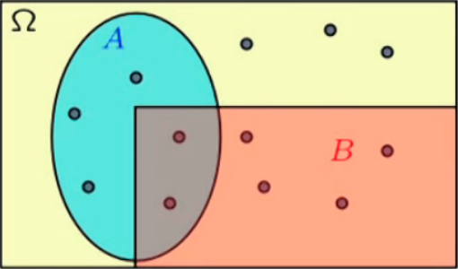
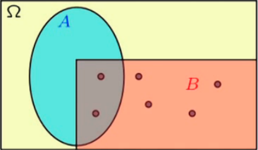

Basic Probability
=================

Probability Theory Overview
---------------------------

.. _what is probability:

What is probability?
~~~~~~~~~~~~~~~~~~~~

Probability theorem provide rules for *systematically* thinking about uncertain
situations. There are several definitions:

- Physical tendencies
- Long-term *frequency*
- Degree of *beliefs*

In short, these definitions complete eachother.

It could be used for predictions.

.. _model:

A probabilistic model
~~~~~~~~~~~~~~~~~~~~~

A probabilistic model is a quantitative description of an *experiment* whose
outcome is uncertain, e.g.:

- tossing a die
- waiting time in a row
- taking an exam

Putting a model together involves two key steps:

**Step 1**:

Describe the possible outcomes, which gives the *sample space*.

**Step 2**:

Specify a probability law, which describes the likelihood of the outcomes.

Sample Space
------------

.. _sample space:

Definition
~~~~~~~~~~

A set of all possible outcomes, notated by :math:`\Omega`.

All elements in the sample space must be mutually exclusive and collectively
exhaustive.

:math:`\Omega` can be:

- discrete: :math:`{1, 2, 3, \ldots}`
- continuous: :math:`[0, 1]`
- finite
- infinite
- etc.

.. _set theorem:

Set Theorem
~~~~~~~~~~~

(Refer to Discrete Mathematics!)

Given empty set :math:`\emptyset`, universal set :math:`\Omega`. Consider 5
sets:

.. math::
   \begin{aligned}
      & \Omega = \{1, 2, \ldots, 10\} \\
      & A = \{1, 3, 5, 7, 9\} \\
      & B = \{2, 4, 6, 8, 10\} \\
      & C = \{1, 2, 3, 4, 5\} \\
      & D = \{4, 8\} \\
   \end{aligned}

We have the following notations:

- Intersection: :math:`A \cap C`
- Union: :math:`A \cup C`
- Compliment: :math:`A^C`
- Disjoint
- Subset
- De Morgan's Law: :math:`(A \cup B)^C = A^C \cup B^C`

Probability Laws
----------------

.. _probability laws:

Definition
~~~~~~~~~~

*Event* is a subset of the sample space. Probability is assigned to events.

Probabilities have to satisfy certain basic properties to be useful, called
Kolmogorov's Axioms:

1. Non-negativity: :math:`P(A) \geq 0`
2. Normalization: :math:`P(\Omega) = 1`
3. Additivity: If :math:`A \cup B = \emptyset`, then `P(A \cup B) = P(A) +
   P(B)`.

Due to the above axioms, we have the following consequences:

1. :math:`P(A) \leq 1`
2. :math:`P(\emptyset) = 0`
3. :math:`P(A) + P(A^C) = 1`
4. If :math:`A \cup B \cup C = \emptyset` then
   :math:`P(A \cup B \cup C) = P(A) + P(B) + P(C)`
5. If :math:`A \subset B` then :math:`P(A) \leq P(B)`
6. :math:`P(A \cup B) = P(A) + P(B) - P(A \cap B)`

.. _discrete uniform laws:

Discrete Uniform Laws
~~~~~~~~~~~~~~~~~~~~~

Given sample space :math:`\Omega` consisting of :math:`n` equally likely
elements, and event :math:`A` consisting of `k` elements, we have:

.. math::

   P(A) = \frac{\text{number of elements of} \ A}{\text{number of elements of} \
   \Omega} = \frac{k}{n}

.. _continuous uniform laws:

Continuous Uniform Law
~~~~~~~~~~~~~~~~~~~~~~

Given :math:`(x, y)` such that :math:`0 \leq x, y \leq 1`.

.. plot::

   import matplotlib.pyplot as plt
   x = [0, 1]
   y = [1, 1]
   plt.plot(x, y)
   plt.plot(y, x)
   plt.xlim(0, 1.5)
   plt.ylim(0, 1.5)
   plt.show()

The uniform law states that the probability of the event will be equal to its 
area on the graph.

.. _probability calculation steps:

Probability Calculation Steps
~~~~~~~~~~~~~~~~~~~~~~~~~~~~~

**Step 1**: Specify the sample space :math:`\Omega`.

**Step 2**: Specify a probability law.

**Step 3**: Identify an event of interest.

**Step 4**: Calculate the desired probability.

.. _geometric series:

Mathematical Background: Geometric Series
~~~~~~~~~~~~~~~~~~~~~~~~~~~~~~~~~~~~~~~~~

Given :math:`|\alpha| < 1`, we have:

.. math::

   \sum_{i = 0}^\infty \alpha^i = 1 + \alpha + \alpha^2 + \ldots = \frac{1}{1
   - \alpha}

Conditional Probabilities
-------------------------

.. _conditional probabilities:

Definition
~~~~~~~~~~

Given a sample space :math:`\Omega`, with two events :math:`A` and :math:`B`. We
have the below illustration:

   Sample space with two events A and B

If we only look at the probability of event :math:`A` happening, *knowing* that
event :math:`B` happens, we obtain the below illustration:

   Sample space, looking at event A knowing that event B happens

For conditional probability:

.. math::

   P(A | B) = \frac{P(A \cap B)}{P(B)}

For multiplication rule:

.. math::

   P(A \cap B) = P(B)P(A|B) = P(A)P(B|A)
