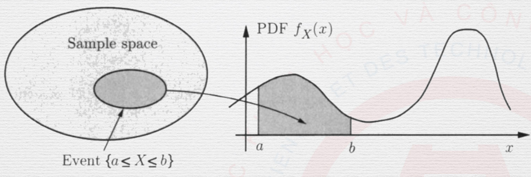
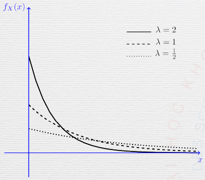
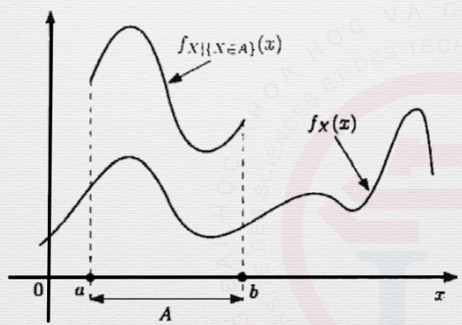

Continuous Random Variables
===========================

.. _continuous random variables:

Continuous Random Variables
---------------------------

(Refer to :ref:`discrete random variables` first.)

Given the same definition, but :math:`x` is an interval instead of some exact
value.

.. _pdf:

Probability Density Function
~~~~~~~~~~~~~~~~~~~~~~~~~~~~

A random variable :math:`X` is called *continuous* if there is a non-negative
function :math:`f_X`, called the *probability density function* of :math:`X`,
such that:

.. math::

   P(a \leq X \leq b) = \int_a^b f_X(x) dx

.. note::

   The PDF has three properties:

   - :math:`f_X(x) \geq 0` for all :math:`x`
   - :math:\int_{-\infty}^\infty f_X(x) dx = 1
   - For any subset :math:`B` of the real line:

   .. math::

      P (X \in B) = \int_B f_X(x) dx

   An example of a PDF mapping events to intervals

.. _continuous mean:

The Mean
~~~~~~~~

The expected value of a random variable :math:`X` with PDF :math:`f_X` is
defined by:

.. math::

   \mathbb{E}[X] = \int_{-\infty}^\infty x f_X(x)dx

.. note::

   Expectations have linearity, as demonstrated below:

   .. math::

      \mathbb{E}[aX+b] = a \mathbb{E}[X] + b

.. _continuous expected value:

Expected Value Rule
~~~~~~~~~~~~~~~~~~~

(Refer to :ref:`expected value rule`.)

.. math::

   \mathbb{E}[g(X)] = \int_{-\infty}^\infty g(x) f_X(x)dx

.. _continuous variance:

Variance
~~~~~~~~

Same as its discrete variant. Refer to :ref:`variance`.

.. _cdf:

Cumulative Distribution Functions
---------------------------------

The CDF of a random variable :math:`X` is denoted by :math:`F_X` and provides
the probability :math:`P(X \leq x)`.

.. math::

   F_X(x) = P(X \leq x)

For continuous random variables:

.. math::

   F_X(x) = P(X \leq x) = \int_{-\infty}^x f_X(t)dt

For discrete random variables (Refer to :ref:`discrete random variables`.):

.. math::

   F_X(x) = P(X \leq x) = \sum_{-\infty}^x p_X(k)

.. note::

   CDF has three properties:

   - Non-decreasing
   - As :math:`x \rightarrow \infty`, :math:`F_X(x)` approaches :math:`1`.
   - As :math:`x \rightarrow -\infty`, :math:`F_X(x)` approaches :math:`0`.

.. _continuous common rv:

Common Random Variables
-----------------------

.. _exponential:

Exponential Random Variable
~~~~~~~~~~~~~~~~~~~~~~~~~~~

   An exponential random variable with different values of :math:`\lambda`

.. math::

   f_X(x) = \begin{cases}
   \begin{aligned}
   \lambda e^{-\lambda x} \quad & x \geq 0 \\
   0 \quad & x < 0 \\
   \end{aligned}
   \end{cases}

.. _standard gaussian:

Standard Gaussian Random Variable
~~~~~~~~~~~~~~~~~~~~~~~~~~~~~~~~~

A continuous random variable :math:`X` is said to be standard normal `N(0, 1)`
if it has a PDF of the form:

.. math::

   f_X(x) = \frac{1}{\sqrt{2\pi}} e^\frac{-x^2}{2}

.. _gaussian:

Gaussian Random Variable
~~~~~~~~~~~~~~~~~~~~~~~~

A continuous random variable :math:`X` is said to be normal or Gaussian if it
has a PDF of the form:

.. math::

   f_X(x) = \frac{1}{\sqrt{2\pi}\sigma} e^\frac{-(x-\mu)^2}{2\sigma ^2}

This is **the most important** PDF in probability theorem.

.. note::

   The Gaussian random variable has two properties:

   - :math:`\mathbb{E}[X] = \mu`
   - :math:`\text{var}[X] = \sigma^2`

.. _linear functions:

Linear Functions of :math:`N(\mu , \sigma^2)`
~~~~~~~~~~~~~~~~~~~~~~~~~~~~~~~~~~~~~~~~~~~~~

Let :math:`X ~ N(\mu , \sigma^2)`, :math:`Y = aX + b`. Then:

.. math::

   Y ~ N(a \mu + b, a^2\sigma^2)

.. _conditional pdf event:

Conditional PDF on an Event
---------------------------

The conditional PDF of :math:`X`, given an event :math:`A` with :math:`P(A) > 0`
is defined by:

.. math::

   P(X \in B | A) = \int_B f_{X | A}(x) dx

   An example of conditional PDF on an event.

.. _conditional pdf expectations event:

Conditional Expectations on an Event
~~~~~~~~~~~~~~~~~~~~~~~~~~~~~~~~~~~~

(Refer to :ref:`conditional pdf expectations`.)

The conditional expectation of :math:`X` given an event :math:`A` with
:math:`P(A) > 0` is defined by:

.. math::

   \mathbb{E}[X | A] = \int x f_{X | A}(x) dx

.. _conditional pdf expected value rule:

Expected Value Rule
~~~~~~~~~~~~~~~~~~~

(Refer to :ref:`expected value rule`.)

For a function :math:`g(X)`:

.. math::

   \mathbb{E}[g(X) | A] = \int g(x) f_{X | A}(x) dx

.. _conditional pdf total probability:

Total Expectation Theorem
~~~~~~~~~~~~~~~~~~~~~~~~~

(Refer to :ref:`total probability theorem`.)

If :math:`A_1, \ldots , A_n` be *disjoint events* that form a partition of the
sample space, with :math:`P(A_i) > 0` for all :math:`i`, then:

.. math::

   \mathbb{E}[X] = \sum_{i = 1}^n P(A_i) \mathbb{E}[X | A_i]

.. _mixed random variables:

Mixed Random Variables
~~~~~~~~~~~~~~~~~~~~~~

Consider the following random variable :math:`X`:

.. math::

   X = \begin{cases}
   \begin{aligned}
   \text{uniform on} \ [0, 2] \quad & \text{w.p.} \frac{1}{2} \\
   1 \quad & \text{w.p.} \frac{1}{2}
   \end{aligned}
   \end{cases}

You cannot obtain neither the PDF nor the PMF, so the only thing you can use is
the CDF for this random variable.

.. _multiple continuous rv:

Multiple Continuous Random Variables
------------------------------------

.. _joint pdf:

Joint PDF
~~~~~~~~~

Two random variables :math:`X` and :math:`Y`, associated with the *same
experiment* are jointly continuous if they can be described with a joint PDF
:math:`f_{X,Y}`:

.. math::

   P((X,Y) \in B) = \iint_{(x,y) \in B} f_{X,Y}(x,y) dxdy

.. _marginal pdf:

Marginal PDF
~~~~~~~~~~~~

We can calculate the PDFs of :math:`X` and :math:`Y` using the formulas:

.. math::

   \begin{aligned}
   & f_X(x) = \int_\infty f_{X,Y}(x,y)dy \\
   & f_Y(y) = \int_\infty f_{X,Y}(x,y)dx
   \end{aligned}

.. _joint cdf:

Joint CDF
~~~~~~~~~

If :math:`X` and :math:`Y` are two random variables associated with the same
experiment, their joint CDF is defined by:

.. math::

   F_{X, Y}(x,y) = P(X \leq x, Y \leq y)

With two continuous random variables:

.. math::

   P(X \leq x, Y \leq y) = \int_{-\infty}^x \int_{-\infty}^y f_{X,Y}(s,t)dsdt

.. _conditional pdf random variable:

Conditional PDF on a Random Variable
------------------------------------

The conditional PDF :math:`f_{X|Y}` of :math:`X` given :math:`Y` is defined by:

.. math::

   f_{X|Y}(x|y) = \frac{f_{X,Y}(x,y)}{f_Y(y)}

The conditional PDF of :math:`X` given :math:`Y = y` is related to the joint PDF
by:

.. math::

   f_{X, Y}(x, y) = f_Y(y) f_{X|Y}(x|y)

.. _conditional expectations rv:

Conditional Expectations on a Random Variable
~~~~~~~~~~~~~~~~~~~~~~~~~~~~~~~~~~~~~~~~~~~~~

The conditional expectation of a random variable :math:`X` given a value
:math:`y` of :math:`Y` is defined by:

.. math::

   \mathbb{E}[X|Y=y] = \int x f_{X|Y}(x|y)dx

.. _conditional pdf rv total expectation:

Total Expectation Theorem
~~~~~~~~~~~~~~~~~~~~~~~~~

(Refer to :ref:`conditional pmf rv total expectation` first.)

Given two random variables :math:`X` and :math:`Y`:

.. math::

   \mathbb{E}[X] = \int f_Y(y) \mathbb{E}[X|Y=y] dy

.. _conditional pdf rv independence:

Independence
~~~~~~~~~~~~

Two random variables :math:`X` and :math:`Y` are independent if:

.. math::

   f_{X,Y}(x,y) = f_X(x) f_Y(y)

.. note::

   If two random variables are independent:

   - :math:`\mathbb{E}[XY] = \mathbb{E}[X] \mathbb{E}[Y]`
   - :math:`\text{var}(X + Y) = \text{var}(X) + \text{var}(Y)`
