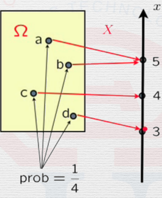
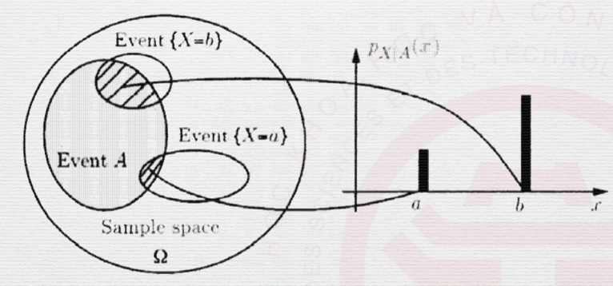
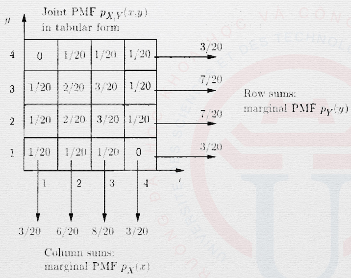
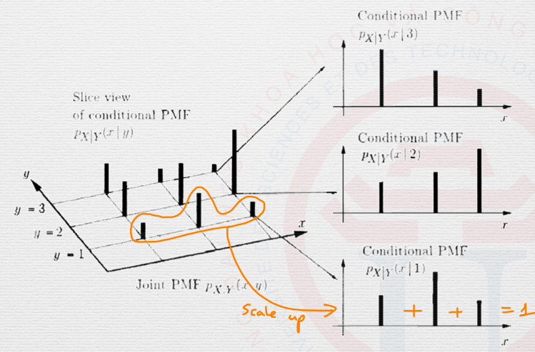

Discrete Random Variables
=========================

.. _discrete random variables:

Discrete Random Variables
-------------------------

The formal definition of discrete random variables is as follows:

.. math::

   \begin{aligned}
      X: \ & \text{sample space} \ \Omega \rightarrow \mathbb{R} \\
         & \text{outcome} \ \omega \rightarrow x \\
   \end{aligned}

.. note::
   
   Notation for the random variable is :math:`X`, while its numerical value is
   notated by :math:`x`.

   - One sample space could have multiple random variables.
   - A function of random variable(s) is also a random variable.

.. _pmf:

Probability Mass Function
-------------------------

Probability mass function (PMF) is also known as the Probability Law or
Probability Distribution. It is a function that gives the *probability* that a
DRV is *exactly equal* to some value.

   An example of a PMF mapping events to numerical values

Its formal definition is given below:

.. math::

   p_X(x) = P(X = x)

.. note::

   Two of PMF's basic properties are:

   - :math:`p_X(x) \geq 0`
   - :math:`\sum_x p_X(x) = 1`

.. _common random variables:

Common Random Variables
-----------------------

.. _bernoulli:

Bernoulli Random Variable
~~~~~~~~~~~~~~~~~~~~~~~~~

Given a Bernoulli random variable with parameter :math:`p \in [0, 1]`:

.. math::

   X = \begin{cases}
      1 \quad \text{w.p.} \ p \\
      0 \quad \text{w.p.} \ 1-p \\
   \end{cases}

The Bernoulli RV indicates an event :math:`A` happening.

.. _uniform:

Uniform Random Variable
~~~~~~~~~~~~~~~~~~~~~~~

Given a uniform random variable with parameters :math:`a`, :math:`b`, and
considering the following experiment: Picking one of :math:`a`, :math:`a+1`,...
:math:`b` at random, with equally likely chances.

We will have its sample space being :math:`\{a, a+1, \ldots , b\}`. From that,
we obtain the random variable :math:`X` as given below:

.. math::

   X(\omega) = \omega

.. _binomial:

Binomial Random Variable
~~~~~~~~~~~~~~~~~~~~~~~~

Given a binomial random variable with parameters being *positive integers*
:math:`n, p \in [0, 1]` and considering the following experiment: :math:`n`
independent tosses of a coin with :math:`P(\text{Heads}) = p`.

We will obtain the sample space being a sequence of H and T, of length
:math:`n`. From that, we obtain the random variable :math:`X` as given below:

.. math::

   X: \ \text{number of heads}

We have the formula of a binomial random variable as follows:

.. math::

   p_X(k) = \begin{pmatrix} n \\ k \end{pmatrix} p^k (1-p)^{n-k}

.. _geometric:

Geometric Random Variable:
~~~~~~~~~~~~~~~~~~~~~~~~~~

Given a geometric random variable with parameter :math:`0 < p \leq 1` and
considering the following experiment: Infinitely independent tosses of a coin
with :math:`P(\text{Heads}) = p`.

We will obtain the sample space being an infinite sequence of H and T. From
that, we obtain the random variable :math:`X` as given below:

.. math::

   X: \text{number of tosses until the first head}

We have the formula of a geometric random variable as follows:

.. math::

   p_X(k) = (1-p)^{k-1} p

.. _expectations:

Expectations
------------

.. _mean:

Mean
~~~~

The *expected value* (also called the *expectation* or the *mean*) of a random
variable :math:`X`, with PMF :math:`p_X` is defined by:

.. math::

   \mathbb{E}[X] = \sum_x x p_X(x)

Expectations have linearity, demonstrated below:

.. math::

   \mathbb{E}[X] = a \mathbb{E}[X] + b

.. _expected value rule:

Expected Value Rule
~~~~~~~~~~~~~~~~~~~

Let :math:`X` be a random variable, and :math:`Y = g(X)` be a function of
:math:`X`. By definition:

.. math::

   \mathbb{E}[g(X)] = \mathbb{E}[Y] = \sum_y y p_Y(y)

From that, we can obtain the general form of the expected value rule for any
function :math:`g(X)` of random variable :math:`X`:

.. math::

   \mathbb{E}[g(X)] = \sum_x g(x) p_X(x)

.. _variance:

Variance
~~~~~~~~

The *variance* is the average distance from the mean, or in other words, the
expected value of the random variable :math:`g(X) = (X - \mathbb{E}[X])^2`.

.. math::

   \text{var}(X) = \mathbb{E}[(X - \mathbb{E}[X])]^2

With the variance, we can also obtain the standard deviation:

.. math::

   \sigma_X = \sqrt{\text{var}(X)}

.. note::

   Variance has two properties, given a random variable :math:`X`:

   - :math:`\text{var}[aX + b] = a^2 \text{var}[X]`
   - :math:`\text{var}[X] = \mathbb{E}[X^2] - (\mathbb{E}[X])^2`

.. _conditional pmf event:

Conditional PMF on an Event
---------------------------

.. _conditional pmf event definition:

Definition
~~~~~~~~~~

The *conditional PMF* of :math:`X`, given an event :math:`A` with :math:`P(A) >
0` is defined by:

.. math::

   p_{X|A}(x) = P(X = x | a) = \frac{P(\{X = x\} \cup A)}{P(A)}

.. note::

   Sanity check: verify that:

   .. math::

      \sum_x p_{X|A}(x) = 1

   An example of conditional PMF on an event

.. _conditional pmf expectations:

Conditional Expectations on an Event
~~~~~~~~~~~~~~~~~~~~~~~~~~~~~~~~~~~~

The *conditional expectation* of :math:`X` given an event :math:`A` with
:math:`P(A) > 0` is defined by:

.. math::

   \mathbb{E}[X|A] = \sum_x x p_{X|A}(x)

.. note::

   This is very similar to the normal expectation of a discrete random variable.
   (Refer to :ref:`mean`.)

From that, we also have the expected value rule:

.. math::

   \mathbb{E}[g(X)|A] = \sum_x g(x)p_{X|A}(x)

.. _total expectation theorem:

(Refer to :ref:`total probability theorem` first.)

If :math:`A_1, \ldots , A_n` be *disjoint events* that form a partition of the
sample space, with :math:`P(A_i) > 0` for all :math:`i`, then:

.. math::

   \mathbb{E}[X] = \sum_{i=1}^n P(A_i) \mathbb{E}[X | A_i]

.. _multiple drv:

Multiple Random Variables
-------------------------

.. _joint pmf:

Joint PMF
~~~~~~~~~

Consider two discrete random variables :math:`X` and :math:`Y`, associated with
*the same experiment* (very important!). The joint PMF of :math:`X` and
:math:`Y` is defined by:

.. math::

   \begin{aligned}
   p_{X, Y}(x,y) & = P(\{X = x\} \cup \{Y = y\}) \\
   & = P(X = x, Y = y)
   \end{aligned}

.. _marginal pmf:

Marginal PMF
~~~~~~~~~~~~

We can calculate the PMFs of :math:`X` and :math:`Y` seperately (referred to as
the marginal PMF of :math:`X` and :math:`Y`) by using the formulas:

.. math::

   \begin{aligned}
   & p_X(x) = \sum_y p_{X,Y}(x,y) \\
   & p_Y(y) = \sum_x p_{X,Y}(x,y)
   \end{aligned}

.. note::

   Proof of the above formula:

   .. math::
      
      \begin{aligned}
      p_X(x) & = P(X = x) \\
      & = \sum_y P(X = x, Y = y) \\
      & = \sum_y p_{X,Y}(x,y)
      \end{aligned}

The joint PMF and the marginal PMF of a random variable can be displayed in a
tabular form, as shown below:

   Joint PMF and marginal PMF of a random variable in tabular form

.. _drv expected value rule:

Expected Value Rule
~~~~~~~~~~~~~~~~~~~

A function :math:`g(X,Y)` of :math:`X` and :math:`Y` defines another random
variable, and:

.. math::

   \mathbb{E}[g(X,Y)] = \sum_x \sum_y g(x,y)p_{X,Y}(x,y)

.. note::

   The above expected value rule has linearity:

   .. math::

      \mathbb{E}[aX_1 + bX_2 + c] = a \mathbb{E}[X_1] + b \mathbb{E}[X_2] + c

.. _conditional pmf random variable:

Conditional PMF on a Random Variable
------------------------------------

.. _conditional pmf random variable definition:

Definition
~~~~~~~~~~

The conditional PMF :math:`P(X=x | Y=y)` of :math:`X` given :math:`Y` is defined
by:

.. math::

   p_{X|Y}(x|y) = \frac{P(\{X=x, Y=y\})}{P(Y=y)} = \frac{p_{X,Y}(x,y)}{p_Y(y)}

.. note::

   Sanity check: verify that:

   .. math::

      \sum_x p_{X|Y}(x|y) = 1

The conditional PMF on a random variable can be displayed in a 3-dimensional
graph like below:

   A conditional PMF on a random variable displayed in graph form

The conditional PMF of :math:`X` given :math:`Y=y` is related to the joint PMF
by:

.. math::

   p_{X,Y}(x,y) = p_Y(y)p_{X,Y}(x|y)

.. _conditional expectations random variable:

Conditional Expectations on a Random Variable
~~~~~~~~~~~~~~~~~~~~~~~~~~~~~~~~~~~~~~~~~~~~~

The conditional expectation of a random variable :math:`X` given a value
:math:`y` of :math:`Y` is given by:

.. math::

   \mathbb{E}[X|Y=y] = \sum_x x p_{X|Y}(x|y)

.. _conditional pmf rv total expectation:

Total Expectation Theorem
~~~~~~~~~~~~~~~~~~~~~~~~~

Given two random variables :math:`X` and :math:`Y`, the unconditional average
can be obtained by averaging the conditional averages.

.. math::

   \mathbb{E}[X] = \sum_y p_Y(y) \mathbb{E}[X|Y=y]

.. _conditional pmf rv independence:

Independence
~~~~~~~~~~~~

Two random variables :math:`X` and :math:`Y` are independent if:

.. math::

   p_{X,Y}(x,y) = p_X(x)p_Y(y)

.. note::

   This is similar to basic probability's independence. (Refer to
   :ref:`independence`.)

   Some properties:

   - :math:`\mathbb{E}[XY] = \mathbb{E}[X] \mathbb{E}[Y]`
   - :math:`\text{var}(X+Y) = \text{var}(X) + \text{var}(Y)`
